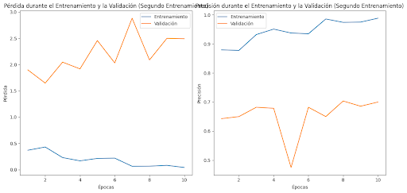

# Proyecto de Detección de Plantas en la Región del Cusco

## Descripción

Bienvenido al repositorio de nuestro proyecto de Machine Learning para la detección de 20 plantas en la región del Cusco. Este proyecto ha sido desarrollado con el objetivo de contribuir al conocimiento y preservación de la diversidad botánica de la zona.

### Implementación

Este proyecto utiliza un modelo de Inteligencia Artificial entrenado para reconocer 20 especies de plantas específicas de la región del Cusco. El modelo se implementa utilizando el framework FastAPI para crear una API (Interfaz de Programación de Aplicaciones) fácil de usar que permite a los usuarios cargar imágenes y recibir predicciones sobre la especie de planta presente en la imagen.

## ¿Qué es una API?

Una API es una interfaz que permite la comunicación entre diferentes aplicaciones. En este contexto, nuestra API permite la interacción entre el modelo de Machine Learning y otras aplicaciones o servicios, facilitando así la detección de plantas mediante el envío de imágenes.

## Resultados

Después de un arduo trabajo en equipo, logramos alcanzar una precisión del 70% en la detección de las plantas. Aunque siempre hay espacio para mejorar, estamos orgullosos de los resultados obtenidos hasta ahora y confiamos en que este modelo será una herramienta valiosa para la identificación de especies vegetales en la región.

### Métricas de Rendimiento

- Precisión: 70%

Los resultados pueden variar según las condiciones de las imágenes y la diversidad de las plantas en la región, pero hemos trabajado diligentemente para hacer que el modelo sea lo más robusto posible.



### Ejemplo de Resultado


En la imagen de arriba, puedes ver un ejemplo de detección en acción. La API analiza la imagen y devuelve la especie de planta identificada junto con la confianza asociada.

## Instrucciones de Uso

1. **Clona el Repositorio:**
   ```bash
   git clone https://github.com/tu-usuario/nombre-del-repo.git
2. **Instala Dependencias:**
   ```bash
   pip install -r requirements.txt
   ```
3. **Ejecuta la aplicación:**
   ````bash
   uvicorn main:app --reload
   ``
4. **Accede a la Interfaz:**
   Visita http://localhost:8000/docs en tu navegador para interactuar con la API a través de Swagger.

   ¡Y eso es todo! Estamos emocionados de compartir nuestro trabajo contigo y esperamos que este proyecto sea útil para la identificación y conservación de la flora en la región del Cusco.